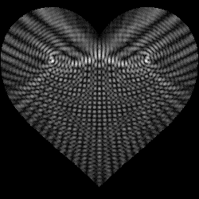
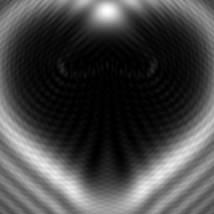
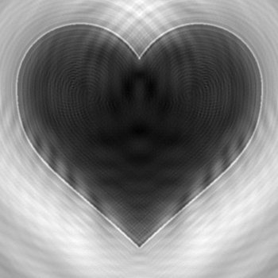

# The-bright-spot

This code is a part of a solution to Problem 9, The Bright Spot from the 2024 edition of the international Physicists' Torunament: https://2024.iptnet.info/problems/

The code can 
- Predict formation of bright spots
- Simulate diffraction using the package Diffractio
- Reverse the diffraction using Pyphase

Due to the limited documentation and tutorials for the Python packages Diffractio and Pyphase, this repo may serve as an example of how to run these packages, although the first party tutorials should naturally be consulted first and foremost.

Licence : No Rights Reserved, CC0, Public Domain
